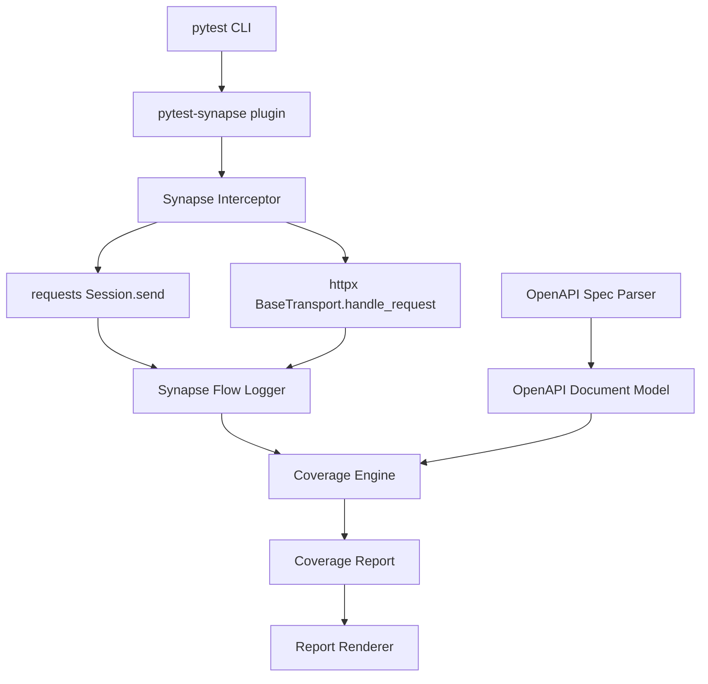

# Architecture

## High level flow

## Components

### Synapse Interceptor
- Applies targeted monkey patches at high level client methods.
- Captures request and response data after TLS decryption.
- Converts client specific objects into a normalized event.

### Synapse Flow Logger
- Thread safe, process aware store for captured traffic.
- Associates each event with the pytest node id to preserve test linkage.

### OpenAPI Spec Parser
- Loads a JSON or YAML OpenAPI document.
- Produces a navigable internal model of paths, operations, and schemas.

### Coverage Engine
- Matches observed requests to OpenAPI operations.
- Validates request and response bodies against schemas.
- Updates a coverage map with covered and uncovered elements.

### Report Renderer
- CLI summary output for quick visibility.
- JSON report for CI pipelines and automation.

## Data model
Captured traffic is normalized into a single event type:

- test_id: pytest node id
- request: method, path, query, headers, body
- response: status, headers, body
- timestamp

This model removes client specific differences and keeps coverage logic consistent.
